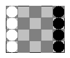

eight bishop a* search on lua
=============================
Программа с помощью А* поиска решает как передвинуть восемь доминошек чтобы они
поменялись местами не скушав друг друга и выводит результат в виде
упорядоченного набора png файлов.
Результат скомпилированный в gif с помощью VirtualDub

